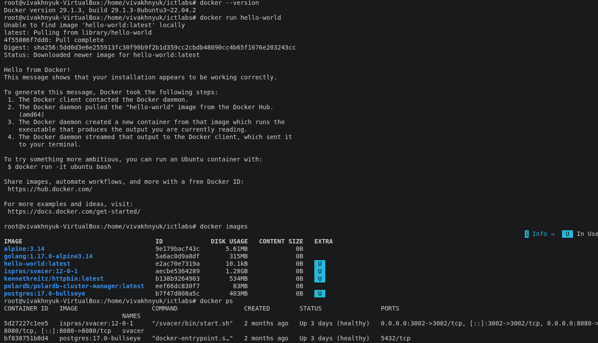
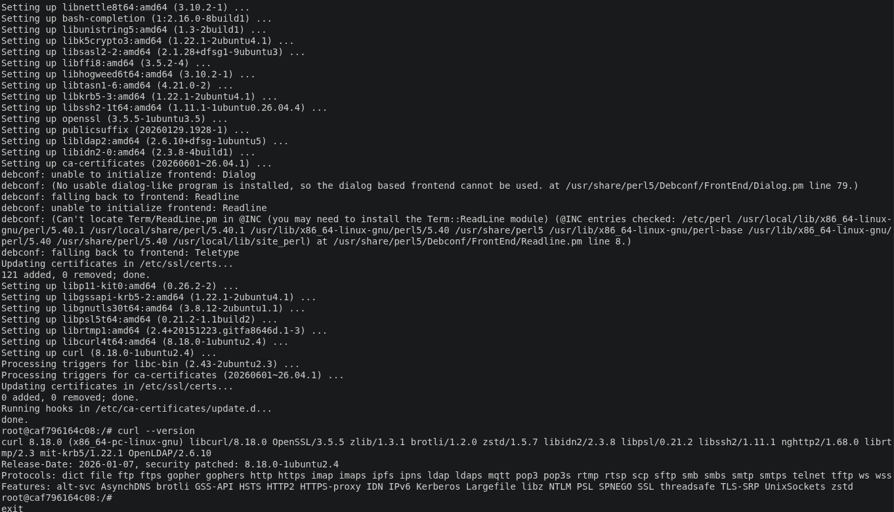
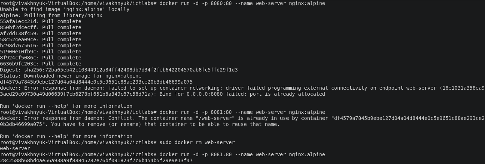
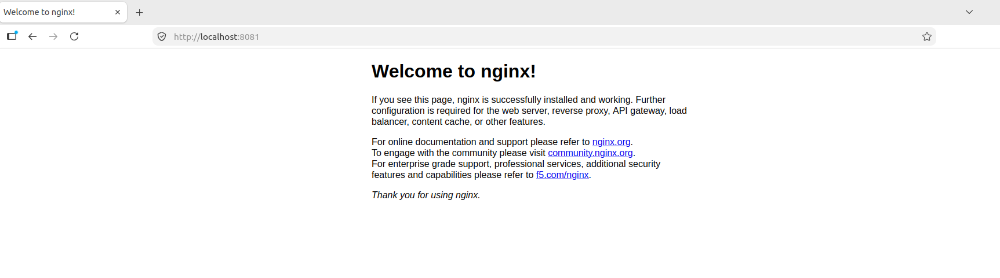
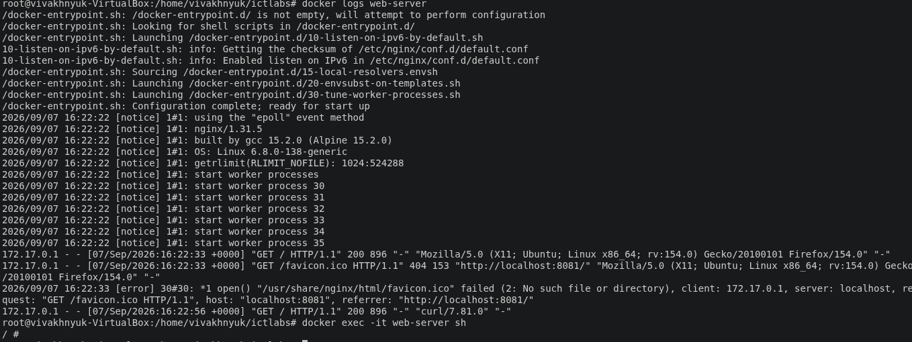
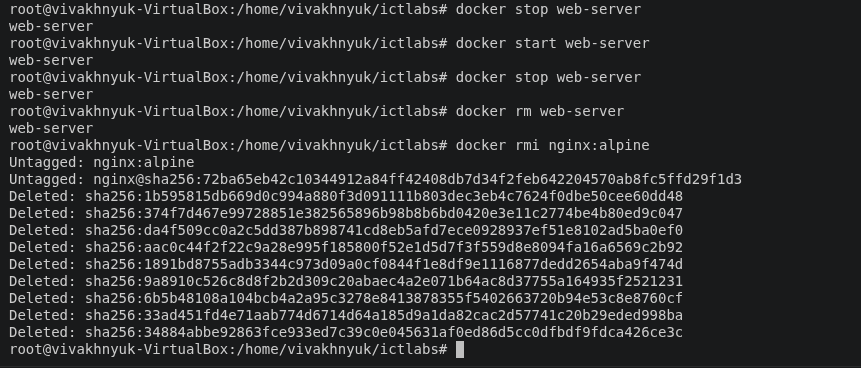
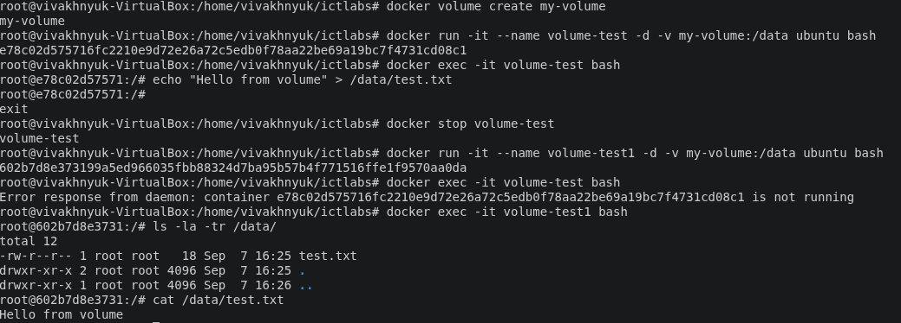

# Отчет по первой лабораторной
## Ход работы
### 1. Установка Docker

Работа выполнялась на виртуалке Убунты 22 с уже установленным Докером. Вывод команд для проверки установки представлен на скриншоте ниже

### 2. Работа с готовыми образами

Был скачан и запущен в интерактивном режиме образ ubuntu:latest. Проведена установка curl и проверка версии. Вывод команд представлен на скриншоте ниже

### 3. Запуск веб-сервера

Был скачан и запущен контейнер с веб сервером nginx. Проброшенный порт был изменен на 8081 в связи с тем что 8080 был уже занят. Результат запуска, стартовая веб-страница и логи контейнера представлены на скриншотах ниже

---

---

---

---

---

---

### 4. Управление контейнерами

Вывод списка контейнеров был представлен на скриншоте первого пункта. Остановка, запуск, и удаление контейнера/образа представлено на скриншоте ниже

### 5. Работа с томами (volumes)

Был запущен контейнер с созданным томом, после чего в интерактивном режиме в директорую, в которую примонтирован том, был записан файл. Затем контейнер был удален, создан новый и проверено содержимое файла. Результат представлен на скриншоте ниже

