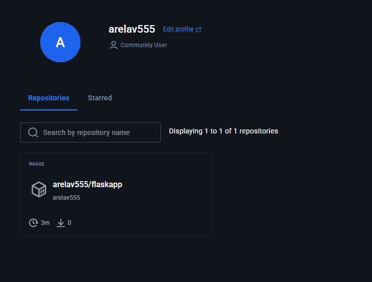

# Отчет по второй лабораторной
## Ход работы

После создания отдельного репозитория (https://github.com/arelavvvv/flask_for_dockerhub) был зарегестрирован аккаунт на докерхабе и подготовлен файл воркфлоу для гитхаба

```yml
name: Docker Build and Push

on:
  push:
    branches:
      - main

jobs:
  build-and-push:
    runs-on: ubuntu-latest

    steps:
      - name: checkout
        uses: actions/checkout@v4

      - name: buildx
        uses: docker/setup-buildx-action@v3

      - name: login
        uses: docker/login-action@v3
        with:
          username: ${{ secrets.DOCKER_USERNAME }}
          password: ${{ secrets.DOCKER_PASSWORD }}

      - name: buildpush
        uses: docker/build-push-action@v5
        with:
          context: .
          push: true
          tags: arelav555/flaskapp:latest

      - name: deploy
        run: echo "Deploying application..."
```

После пуша в репозоторий на докерхабе появился образ



