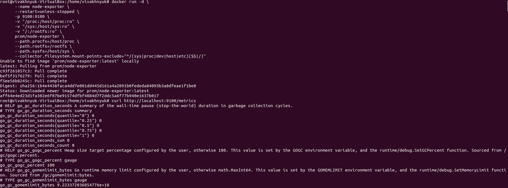
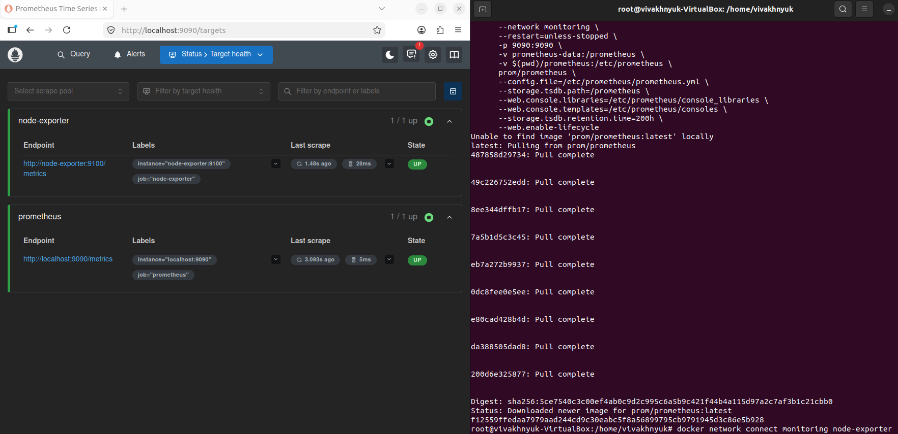
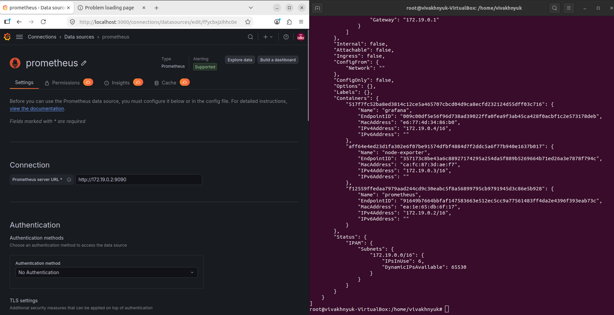
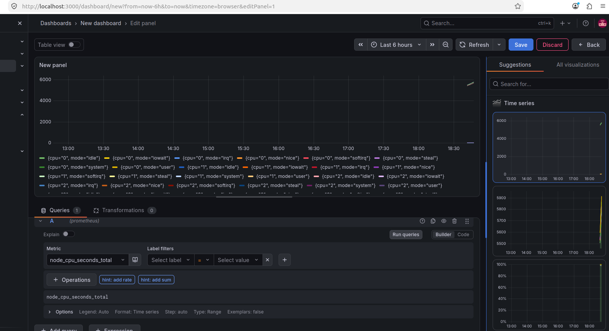
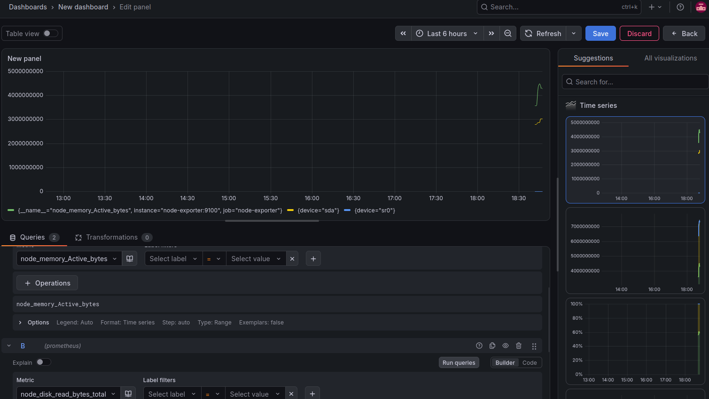

# Отчет по второй лабораторной
## Ход работы

После конфигурации prometheus запускаем node-exporter

Запускаем prometheus предварительно добавив node-exporter в сеть контейнеров

Запускаем grafana, добавляем prometheus как источник, указав ip назначенный ему в сети monitoring

Результат добавления метрики node_cpu_seconds_total представлен на скриншоте ниже

Так же добавляем, node_memory_Active_bytes и node_disk_read_bytes_total скрыв node_cpu_seconds_total для удобства отображения

